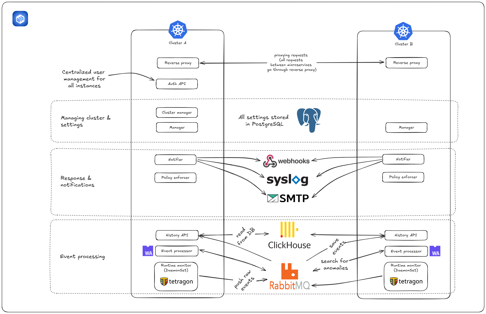

# 
## About Runtime Radar

Runtime Radar is an open-source solution for monitoring runtime security events and responding to incidents in containerized environments.

**Runtime Radar advantages**

Runtime-level threats emerge in real time. For example, containers suddenly start miners, processes gain excessive permissions, or a pod receives unexpected network traffic. Not all companies can stop using vulnerable services until all issues are fixed. In addition, a large number of legacy containers for unused services complicates infrastructure monitoring. The majority of runtime-level protection solutions are expensive and complex. Runtime Radar is an open-source solution that provides accessible protection and user-friendly management tools.

**Runtime Radar features**

Runtime Radar provides the following features:
* Flexible monitoring configuration of runtime events. You can manage sources and filters for monitoring events using a web interface to regulate load on your system.
* Centralized management. With the multicluster installation support, you can manage all existing containers in your infrastructure using a single management point in the web interface.
* Infrastructure integration. With the support for syslog, SMTP, and webhook, you can integrate Runtime Radar with other information security systems in your infrastructure. You can use the protocols and the webhook mechanism to send notifications about events. In addition, you can configure email templates using the Go template engine.
* Flexible rules. You can develop detectors (signatures) in Go to find anomalies and upload them using the provided SDK.
* Incident investigation in the web interface. For incident analysis, you can use tools provided in the product web interface: various event filtering options, viewing of a process context, visualization of runtime event types with icons, creation of response rules on a separate event page with some of the settings already filled in.

**Runtime Radar architecture**

Runtime Radar is a microservice-based solution.

For details about Runtime Radar components, visit the [Runtime Radar (RR) Helm Chart](https://github.com/Runtime-Radar/Runtime-Radar/blob/main/install/helm/README.md) page.

**Getting started**

For details about Runtime Radar installation, visit the [Runtime Radar (RR) Helm Chart](https://github.com/Runtime-Radar/Runtime-Radar/blob/main/install/helm/README.md) page.

For the instructions on how to install the product quickly, visit the [Quick start](https://github.com/Runtime-Radar/Runtime-Radar/blob/main/docs/quickstart/quickstart.md) page.

You can find standard use cases on the [Use cases](https://github.com/Runtime-Radar/Runtime-Radar/blob/main/docs/guides/usecases/usecases.md) page.

For the instructions on how to use the product, visit the [Help](https://github.com/Runtime-Radar/Runtime-Radar/blob/main/docs/guides/help/help.md) page.

**How to contribute**

Before you start, please read the [Contribution Guide](https://github.com/Runtime-Radar/Runtime-Radar/blob/main/docs/contributing.md).
